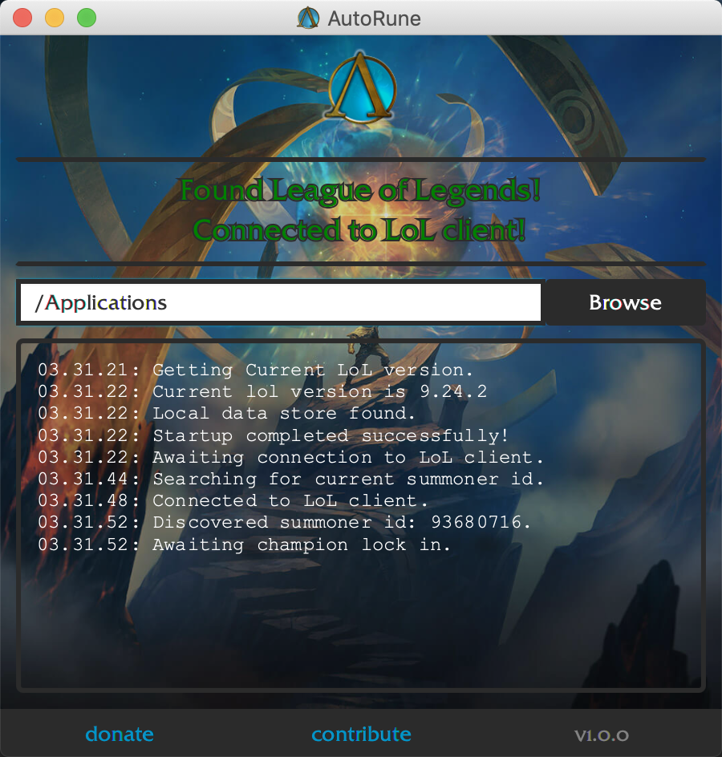
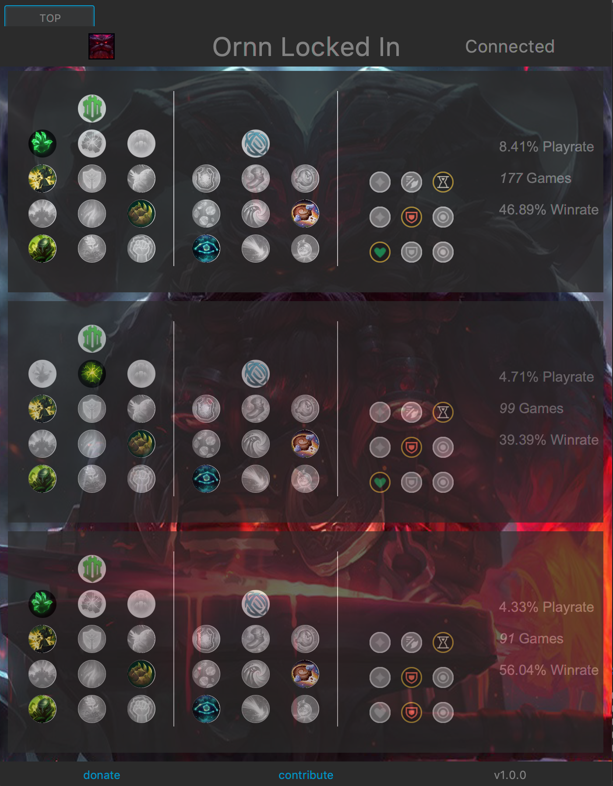

# AutoRune


AutoRune is a program which enables you to swiftly create rune pages based on data provided by op.gg.

Simply leave AutoRune running in the background. When you lock in a champion, the UI will pop up and you can simply click on a Rune Page to have it automatically uploaded and selected for you.

You must have one rune page created named "AutoRune" (case insensitive) for this to work.





## Supported Platforms

Currently only working on Windows. If enough people ask for Mac/Linux I'll consider working on that.

## Build from Source

1. Install [Inno Setup 5](http://www.jrsoftware.org/isdl.php#beta)

2. Compile and run project with ```mvn compile javafx:run -f pom.xml```

## Package

1. Modify the ```<bundler>``` tag in zenjava javafx-maven-plugin to match your target platform.

2. Run ```mvn jfx:native -f pom.xml```

## Legality

[As of a 2018, a Rioter stated the use of the rune page APIs to be "not currently disallowed".](https://www.reddit.com/r/leagueoflegends/comments/7q6xku/runesreformed_set_your_runes_automatically/dsnjm0z/)
